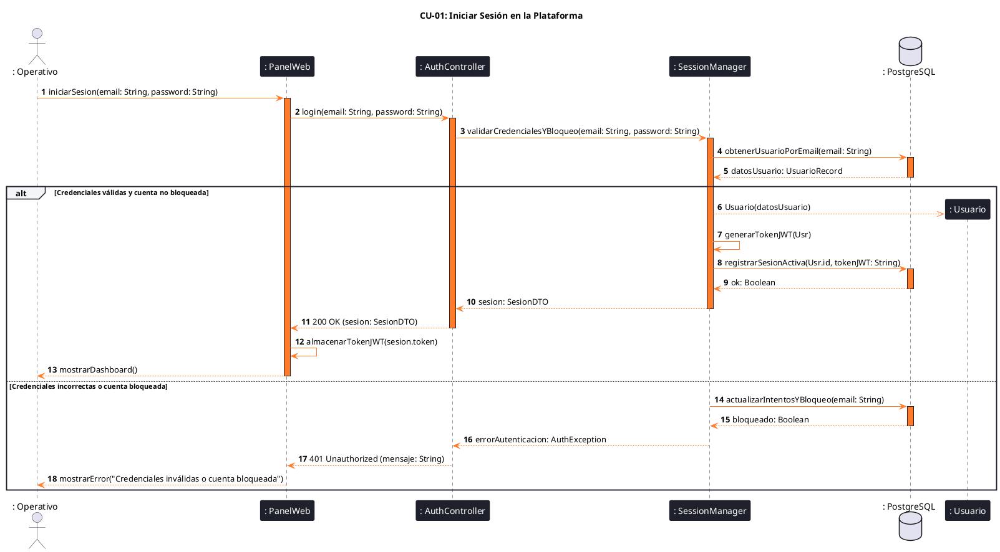

# CU-01: Iniciar Sesión en la Plataforma

```plantuml
@startuml

title CU-01: Iniciar Sesión en la Plataforma

autonumber

skinparam sequence {

    ArrowColor #FF7B29

    LifeLineBorderColor #1E212B

    LifeLineBackgroundColor #FF7B29

    ActorBorderColor #1E212B

    ParticipantBorderColor #1E212B

    ParticipantBackgroundColor #1E212B

    ParticipantFontColor #FFFFFF

    DatabaseBorderColor #1E212B

    DatabaseBackgroundColor #1E212B

    DatabaseFontColor #FFFFFF

    GroupBorderColor #1E212B

    GroupBackgroundColor #F4F5F7

}

actor ": Operativo" as U

participant ": PanelWeb" as FE

participant ": AuthController" as AuthCtrl

participant ": SessionManager" as SessionMgr

database ": PostgreSQL" as DB

U -> FE : iniciarSesion(email: String, password: String)

activate FE

FE -> AuthCtrl : login(email: String, password: String)

activate AuthCtrl

AuthCtrl -> SessionMgr : validarCredencialesYBloqueo(email: String, password: String)

activate SessionMgr

SessionMgr -> DB : obtenerUsuarioPorEmail(email: String)

activate DB

DB --> SessionMgr : datosUsuario: UsuarioRecord

deactivate DB

alt Credenciales válidas y cuenta no bloqueada

    create participant ": Usuario" as Usr

    SessionMgr -->> Usr : Usuario(datosUsuario)

    SessionMgr -> SessionMgr : generarTokenJWT(Usr)

    SessionMgr -> DB : registrarSesionActiva(Usr.id, tokenJWT: String)

    activate DB

    DB --> SessionMgr : ok: Boolean

    deactivate DB

    SessionMgr --> AuthCtrl : sesion: SesionDTO

    deactivate SessionMgr

    AuthCtrl --> FE : 200 OK (sesion: SesionDTO)

    deactivate AuthCtrl

    FE -> FE : almacenarTokenJWT(sesion.token)

    FE --> U : mostrarDashboard()

    deactivate FE

else Credenciales incorrectas o cuenta bloqueada

    SessionMgr -> DB : actualizarIntentosYBloqueo(email: String)

    activate DB

    DB --> SessionMgr : bloqueado: Boolean

    deactivate DB

    SessionMgr --> AuthCtrl : errorAutenticacion: AuthException

    deactivate SessionMgr

    AuthCtrl --> FE : 401 Unauthorized (mensaje: String)

    deactivate AuthCtrl

    FE --> U : mostrarError("Credenciales inválidas o cuenta bloqueada")

    deactivate FE

end

@enduml
```
