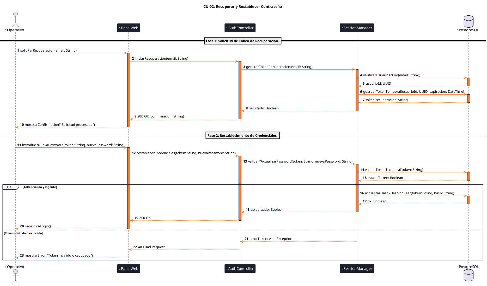

# CU-02: Recuperar y Restablecer Contraseña

```plantuml
@startuml

title CU-02: Recuperar y Restablecer Contraseña

autonumber

skinparam sequence {

    ArrowColor #FF7B29

    LifeLineBorderColor #1E212B

    LifeLineBackgroundColor #FF7B29

    ActorBorderColor #1E212B

    ParticipantBorderColor #1E212B

    ParticipantBackgroundColor #1E212B

    ParticipantFontColor #FFFFFF

    DatabaseBorderColor #1E212B

    DatabaseBackgroundColor #1E212B

    DatabaseFontColor #FFFFFF

    GroupBorderColor #1E212B

    GroupBackgroundColor #F4F5F7

}

actor ": Operativo" as U

participant ": PanelWeb" as FE

participant ": AuthController" as AuthCtrl

participant ": SessionManager" as SessionMgr

database ": PostgreSQL" as DB

== Fase 1: Solicitud de Token de Recuperación ==

U -> FE : solicitarRecuperacion(email: String)

activate FE

FE -> AuthCtrl : iniciarRecuperacion(email: String)

activate AuthCtrl

AuthCtrl -> SessionMgr : generarTokenRecuperacion(email: String)

activate SessionMgr

SessionMgr -> DB : verificarUsuarioActivo(email: String)

activate DB

DB --> SessionMgr : usuarioId: UUID

deactivate DB

SessionMgr -> DB : guardarTokenTemporal(usuarioId: UUID, expiracion: DateTime)

activate DB

DB --> SessionMgr : tokenRecuperacion: String

deactivate DB

SessionMgr --> AuthCtrl : resultado: Boolean

deactivate SessionMgr

AuthCtrl --> FE : 200 OK (confirmacion: String)

deactivate AuthCtrl

FE --> U : mostrarConfirmacion("Solicitud procesada")

deactivate FE

== Fase 2: Restablecimiento de Credenciales ==

U -> FE : introducirNuevaPassword(token: String, nuevaPassword: String)

activate FE

FE -> AuthCtrl : restablecerCredenciales(token: String, nuevaPassword: String)

activate AuthCtrl

AuthCtrl -> SessionMgr : validarYActualizarPassword(token: String, nuevaPassword: String)

activate SessionMgr

SessionMgr -> DB : validarTokenTemporal(token: String)

activate DB

DB --> SessionMgr : estadoToken: Boolean

deactivate DB

alt Token válido y vigente

    SessionMgr -> DB : actualizarHashYDesbloquear(token: String, hash: String)

    activate DB

    DB --> SessionMgr : ok: Boolean

    deactivate DB

    SessionMgr --> AuthCtrl : actualizado: Boolean

    deactivate SessionMgr

    AuthCtrl --> FE : 200 OK

    deactivate AuthCtrl

    FE --> U : redirigirALogin()

    deactivate FE

else Token inválido o expirado

    SessionMgr --> AuthCtrl : errorToken: AuthException

    deactivate SessionMgr

    AuthCtrl --> FE : 400 Bad Request

    deactivate AuthCtrl

    FE --> U : mostrarError("Token inválido o caducado")

    deactivate FE

end

@enduml
```
