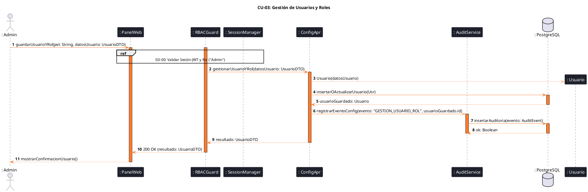

# CU-03: Gestión de Usuarios y Roles

```plantuml
@startuml

title CU-03: Gestión de Usuarios y Roles

autonumber

skinparam sequence {

    ArrowColor #FF7B29

    LifeLineBorderColor #1E212B

    LifeLineBackgroundColor #FF7B29

    ActorBorderColor #1E212B

    ParticipantBorderColor #1E212B

    ParticipantBackgroundColor #1E212B

    ParticipantFontColor #FFFFFF

    DatabaseBorderColor #1E212B

    DatabaseBackgroundColor #1E212B

    DatabaseFontColor #FFFFFF

    GroupBorderColor #1E212B

    GroupBackgroundColor #F4F5F7

}

actor ": Admin" as Admin

participant ": PanelWeb" as FE

participant ": RBACGuard" as RBAC

participant ": SessionManager" as SessionMgr

participant ": ConfigApr" as ConfigApr

participant ": AuditService" as AuditSvc

database ": PostgreSQL" as DB

Admin -> FE : guardarUsuarioYRol(jwt: String, datosUsuario: UsuarioDTO)

activate FE

ref over FE, SessionMgr : SD-00: Validar Sesión JWT y Rol ("Admin")

activate RBAC

RBAC -> ConfigApr : gestionarUsuarioYRol(datosUsuario: UsuarioDTO)

activate ConfigApr

create participant ": Usuario" as Usr

ConfigApr -->> Usr : Usuario(datosUsuario)

ConfigApr -> DB : insertarOActualizarUsuario(Usr)

activate DB

DB --> ConfigApr : usuarioGuardado: Usuario

deactivate DB

ConfigApr ->> AuditSvc : registrarEventoConfig(evento: "GESTION_USUARIO_ROL", usuarioGuardado.id)

activate AuditSvc

AuditSvc -> DB : insertarAuditoria(evento: AuditEvent)

activate DB

DB --> AuditSvc : ok: Boolean

deactivate DB

deactivate AuditSvc

ConfigApr --> RBAC : resultado: UsuarioDTO

deactivate ConfigApr

RBAC --> FE : 200 OK (resultado: UsuarioDTO)

deactivate RBAC

FE --> Admin : mostrarConfirmacionUsuario()

deactivate FE

@enduml
```
