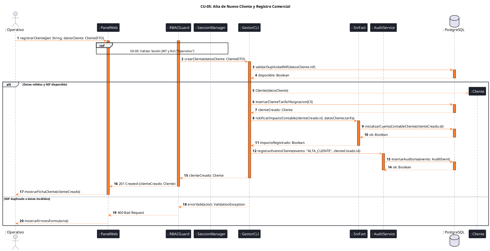

# CU-05: Alta de Nuevo Cliente y Registro Comercial

```plantuml
@startuml

title CU-05: Alta de Nuevo Cliente y Registro Comercial

autonumber

skinparam sequence {

    ArrowColor #FF7B29

    LifeLineBorderColor #1E212B

    LifeLineBackgroundColor #FF7B29

    ActorBorderColor #1E212B

    ParticipantBorderColor #1E212B

    ParticipantBackgroundColor #1E212B

    ParticipantFontColor #FFFFFF

    DatabaseBorderColor #1E212B

    DatabaseBackgroundColor #1E212B

    DatabaseFontColor #FFFFFF

    GroupBorderColor #1E212B

    GroupBackgroundColor #F4F5F7

}

actor ": Operativo" as Op

participant ": PanelWeb" as FE

participant ": RBACGuard" as RBAC

participant ": SessionManager" as SessionMgr

participant ": GestorCLI" as GestorCLI

participant ": SrvFact" as SrvFact

participant ": AuditService" as AuditSvc

database ": PostgreSQL" as DB

Op -> FE : registrarCliente(jwt: String, datosCliente: ClienteDTO)

activate FE

ref over FE, SessionMgr : SD-00: Validar Sesión JWT y Rol ("Operativo")

activate RBAC

RBAC -> GestorCLI : crearCliente(datosCliente: ClienteDTO)

activate GestorCLI

GestorCLI -> DB : validarDuplicidadNIF(datosCliente.nif)

activate DB

DB --> GestorCLI : disponible: Boolean

deactivate DB

alt Datos válidos y NIF disponible

    create participant ": Cliente" as Cli

    GestorCLI -->> Cli : Cliente(datosCliente)

    GestorCLI -> DB : insertarClienteTarifaYAsignacion(Cli)

    activate DB

    DB --> GestorCLI : clienteCreado: Cliente

    deactivate DB

    GestorCLI -> SrvFact : notificarImpactoContable(clienteCreado.id, datosCliente.tarifa)

    activate SrvFact

    SrvFact -> DB : inicializarCuentaContableCliente(clienteCreado.id)

    activate DB

    DB --> SrvFact : ok: Boolean

    deactivate DB

    SrvFact --> GestorCLI : impactoRegistrado: Boolean

    deactivate SrvFact

    GestorCLI ->> AuditSvc : registrarEventoCliente(evento: "ALTA_CLIENTE", clienteCreado.id)

    activate AuditSvc

    AuditSvc -> DB : insertarAuditoria(evento: AuditEvent)

    activate DB

    DB --> AuditSvc : ok: Boolean

    deactivate DB

    deactivate AuditSvc

    GestorCLI --> RBAC : clienteCreado: Cliente

    deactivate GestorCLI

    RBAC --> FE : 201 Created (clienteCreado: Cliente)

    deactivate RBAC

    FE --> Op : mostrarFichaCliente(clienteCreado)

    deactivate FE

else NIF duplicado o datos inválidos

    GestorCLI --> RBAC : errorValidacion: ValidationException

    deactivate GestorCLI

    RBAC --> FE : 400 Bad Request

    deactivate RBAC

    FE --> Op : mostrarErroresFormulario()

    deactivate FE

end

@enduml
```
