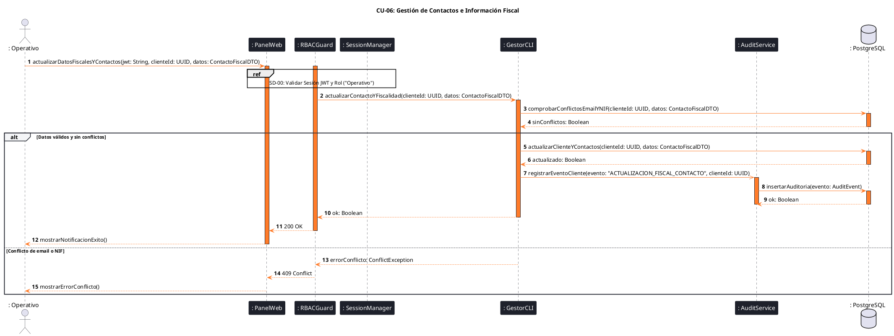

# CU-06: Gestión de Contactos e Información Fiscal

```plantuml
@startuml

title CU-06: Gestión de Contactos e Información Fiscal

autonumber

skinparam sequence {

    ArrowColor #FF7B29

    LifeLineBorderColor #1E212B

    LifeLineBackgroundColor #FF7B29

    ActorBorderColor #1E212B

    ParticipantBorderColor #1E212B

    ParticipantBackgroundColor #1E212B

    ParticipantFontColor #FFFFFF

    DatabaseBorderColor #1E212B

    DatabaseBackgroundColor #1E212B

    DatabaseFontColor #FFFFFF

    GroupBorderColor #1E212B

    GroupBackgroundColor #F4F5F7

}

actor ": Operativo" as Op

participant ": PanelWeb" as FE

participant ": RBACGuard" as RBAC

participant ": SessionManager" as SessionMgr

participant ": GestorCLI" as GestorCLI

participant ": AuditService" as AuditSvc

database ": PostgreSQL" as DB

Op -> FE : actualizarDatosFiscalesYContactos(jwt: String, clienteId: UUID, datos: ContactoFiscalDTO)

activate FE

ref over FE, SessionMgr : SD-00: Validar Sesión JWT y Rol ("Operativo")

activate RBAC

RBAC -> GestorCLI : actualizarContactoYFiscalidad(clienteId: UUID, datos: ContactoFiscalDTO)

activate GestorCLI

GestorCLI -> DB : comprobarConflictosEmailYNIF(clienteId: UUID, datos: ContactoFiscalDTO)

activate DB

DB --> GestorCLI : sinConflictos: Boolean

deactivate DB

alt Datos válidos y sin conflictos

    GestorCLI -> DB : actualizarClienteYContactos(clienteId: UUID, datos: ContactoFiscalDTO)

    activate DB

    DB --> GestorCLI : actualizado: Boolean

    deactivate DB

    GestorCLI ->> AuditSvc : registrarEventoCliente(evento: "ACTUALIZACION_FISCAL_CONTACTO", clienteId: UUID)

    activate AuditSvc

    AuditSvc -> DB : insertarAuditoria(evento: AuditEvent)

    activate DB

    DB --> AuditSvc : ok: Boolean

    deactivate DB

    deactivate AuditSvc

    GestorCLI --> RBAC : ok: Boolean

    deactivate GestorCLI

    RBAC --> FE : 200 OK

    deactivate RBAC

    FE --> Op : mostrarNotificacionExito()

    deactivate FE

else Conflicto de email o NIF

    GestorCLI --> RBAC : errorConflicto: ConflictException

    deactivate GestorCLI

    RBAC --> FE : 409 Conflict

    deactivate RBAC

    FE --> Op : mostrarErrorConflicto()

    deactivate FE

end

@enduml
```
