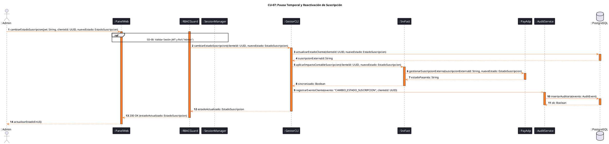

# CU-07: Pausa Temporal y Reactivación de Suscripción

```plantuml
@startuml

title CU-07: Pausa Temporal y Reactivación de Suscripción

autonumber

skinparam sequence {

    ArrowColor #FF7B29

    LifeLineBorderColor #1E212B

    LifeLineBackgroundColor #FF7B29

    ActorBorderColor #1E212B

    ParticipantBorderColor #1E212B

    ParticipantBackgroundColor #1E212B

    ParticipantFontColor #FFFFFF

    DatabaseBorderColor #1E212B

    DatabaseBackgroundColor #1E212B

    DatabaseFontColor #FFFFFF

    GroupBorderColor #1E212B

    GroupBackgroundColor #F4F5F7

}

actor ": Admin" as Admin

participant ": PanelWeb" as FE

participant ": RBACGuard" as RBAC

participant ": SessionManager" as SessionMgr

participant ": GestorCLI" as GestorCLI

participant ": SrvFact" as SrvFact

participant ": PayAdp" as PayAdp

participant ": AuditService" as AuditSvc

database ": PostgreSQL" as DB

Admin -> FE : cambiarEstadoSuscripcion(jwt: String, clienteId: UUID, nuevoEstado: EstadoSuscripcion)

activate FE

ref over FE, SessionMgr : SD-00: Validar Sesión JWT y Rol ("Admin")

activate RBAC

RBAC -> GestorCLI : cambiarEstadoSuscripcion(clienteId: UUID, nuevoEstado: EstadoSuscripcion)

activate GestorCLI

GestorCLI -> DB : actualizarEstadoCliente(clienteId: UUID, nuevoEstado: EstadoSuscripcion)

activate DB

DB --> GestorCLI : suscripcionExternaId: String

deactivate DB

GestorCLI -> SrvFact : aplicarImpactoContableSuscripcion(clienteId: UUID, nuevoEstado: EstadoSuscripcion)

activate SrvFact

SrvFact -> PayAdp : gestionarSuscripcionExterna(suscripcionExternaId: String, nuevoEstado: EstadoSuscripcion)

activate PayAdp

PayAdp --> SrvFact : estadoPasarela: String

deactivate PayAdp

SrvFact --> GestorCLI : sincronizado: Boolean

deactivate SrvFact

GestorCLI ->> AuditSvc : registrarEventoCliente(evento: "CAMBIO_ESTADO_SUSCRIPCION", clienteId: UUID)

activate AuditSvc

AuditSvc -> DB : insertarAuditoria(evento: AuditEvent)

activate DB

DB --> AuditSvc : ok: Boolean

deactivate DB

deactivate AuditSvc

GestorCLI --> RBAC : estadoActualizado: EstadoSuscripcion

deactivate GestorCLI

RBAC --> FE : 200 OK (estadoActualizado: EstadoSuscripcion)

deactivate RBAC

FE --> Admin : actualizarEstadoEnUI()

deactivate FE

@enduml
```
