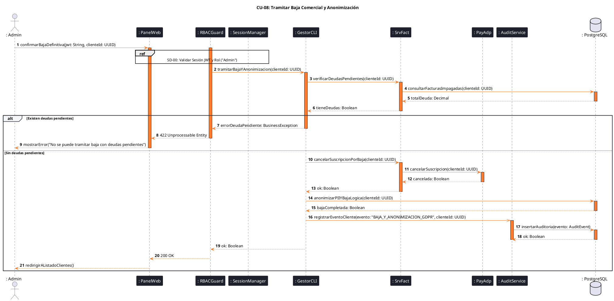

# CU-08: Tramitar Baja Comercial y Anonimización

```plantuml
@startuml

title CU-08: Tramitar Baja Comercial y Anonimización

autonumber

skinparam sequence {

    ArrowColor #FF7B29

    LifeLineBorderColor #1E212B

    LifeLineBackgroundColor #FF7B29

    ActorBorderColor #1E212B

    ParticipantBorderColor #1E212B

    ParticipantBackgroundColor #1E212B

    ParticipantFontColor #FFFFFF

    DatabaseBorderColor #1E212B

    DatabaseBackgroundColor #1E212B

    DatabaseFontColor #FFFFFF

    GroupBorderColor #1E212B

    GroupBackgroundColor #F4F5F7

}

actor ": Admin" as Admin

participant ": PanelWeb" as FE

participant ": RBACGuard" as RBAC

participant ": SessionManager" as SessionMgr

participant ": GestorCLI" as GestorCLI

participant ": SrvFact" as SrvFact

participant ": PayAdp" as PayAdp

participant ": AuditService" as AuditSvc

database ": PostgreSQL" as DB

Admin -> FE : confirmarBajaDefinitiva(jwt: String, clienteId: UUID)

activate FE

ref over FE, SessionMgr : SD-00: Validar Sesión JWT y Rol ("Admin")

activate RBAC

RBAC -> GestorCLI : tramitarBajaYAnonimizacion(clienteId: UUID)

activate GestorCLI

GestorCLI -> SrvFact : verificarDeudasPendientes(clienteId: UUID)

activate SrvFact

SrvFact -> DB : consultarFacturasImpagadas(clienteId: UUID)

activate DB

DB --> SrvFact : totalDeuda: Decimal

deactivate DB

SrvFact --> GestorCLI : tieneDeudas: Boolean

deactivate SrvFact

alt Existen deudas pendientes

    GestorCLI --> RBAC : errorDeudaPendiente: BusinessException

    deactivate GestorCLI

    RBAC --> FE : 422 Unprocessable Entity

    deactivate RBAC

    FE --> Admin : mostrarError("No se puede tramitar baja con deudas pendientes")

    deactivate FE

else Sin deudas pendientes

    GestorCLI -> SrvFact : cancelarSuscripcionPorBaja(clienteId: UUID)

    activate SrvFact

    SrvFact -> PayAdp : cancelarSuscripcion(clienteId: UUID)

    activate PayAdp

    PayAdp --> SrvFact : cancelada: Boolean

    deactivate PayAdp

    SrvFact --> GestorCLI : ok: Boolean

    deactivate SrvFact

    GestorCLI -> DB : anonimizarPIIYBajaLogica(clienteId: UUID)

    activate DB

    DB --> GestorCLI : bajaCompletada: Boolean

    deactivate DB

    GestorCLI ->> AuditSvc : registrarEventoCliente(evento: "BAJA_Y_ANONIMIZACION_GDPR", clienteId: UUID)

    activate AuditSvc

    AuditSvc -> DB : insertarAuditoria(evento: AuditEvent)

    activate DB

    DB --> AuditSvc : ok: Boolean

    deactivate DB

    deactivate AuditSvc

    GestorCLI --> RBAC : ok: Boolean

    deactivate GestorCLI

    RBAC --> FE : 200 OK

    deactivate RBAC

    FE --> Admin : redirigirAListadoClientes()

    deactivate FE

end

@enduml
```
