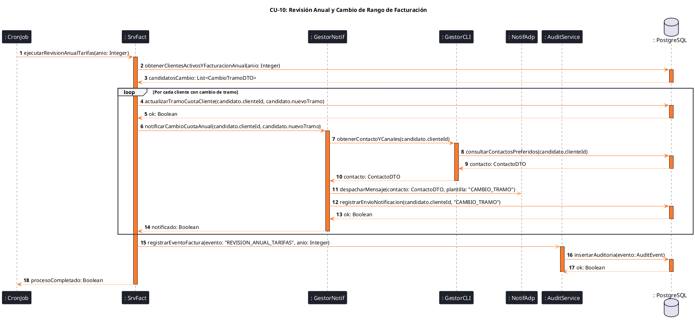

# CU-10: Revisión Anual y Cambio de Rango de Facturación

```plantuml
@startuml

title CU-10: Revisión Anual y Cambio de Rango de Facturación

autonumber

skinparam sequence {

    ArrowColor #FF7B29

    LifeLineBorderColor #1E212B

    LifeLineBackgroundColor #FF7B29

    ParticipantBorderColor #1E212B

    ParticipantBackgroundColor #1E212B

    ParticipantFontColor #FFFFFF

    DatabaseBorderColor #1E212B

    DatabaseBackgroundColor #1E212B

    DatabaseFontColor #FFFFFF

    GroupBorderColor #1E212B

    GroupBackgroundColor #F4F5F7

}

participant ": CronJob" as Cron

participant ": SrvFact" as SrvFact

participant ": GestorNotif" as GestorNotif

participant ": GestorCLI" as GestorCLI

participant ": NotifAdp" as NotifAdp

participant ": AuditService" as AuditSvc

database ": PostgreSQL" as DB

Cron -> SrvFact : ejecutarRevisionAnualTarifas(anio: Integer)

activate SrvFact

SrvFact -> DB : obtenerClientesActivosYFacturacionAnual(anio: Integer)

activate DB

DB --> SrvFact : candidatosCambio: List<CambioTramoDTO>

deactivate DB

loop Por cada cliente con cambio de tramo

    SrvFact -> DB : actualizarTramoCuotaCliente(candidato.clienteId, candidato.nuevoTramo)

    activate DB

    DB --> SrvFact : ok: Boolean

    deactivate DB

    SrvFact -> GestorNotif : notificarCambioCuotaAnual(candidato.clienteId, candidato.nuevoTramo)

    activate GestorNotif

    GestorNotif -> GestorCLI : obtenerContactoYCanales(candidato.clienteId)

    activate GestorCLI

    GestorCLI -> DB : consultarContactosPreferidos(candidato.clienteId)

    activate DB

    DB --> GestorCLI : contacto: ContactoDTO

    deactivate DB

    GestorCLI --> GestorNotif : contacto: ContactoDTO

    deactivate GestorCLI

    GestorNotif ->> NotifAdp : despacharMensaje(contacto: ContactoDTO, plantilla: "CAMBIO_TRAMO")

    GestorNotif -> DB : registrarEnvioNotificacion(candidato.clienteId, "CAMBIO_TRAMO")

    activate DB

    DB --> GestorNotif : ok: Boolean

    deactivate DB

    GestorNotif --> SrvFact : notificado: Boolean

    deactivate GestorNotif

end

SrvFact ->> AuditSvc : registrarEventoFactura(evento: "REVISION_ANUAL_TARIFAS", anio: Integer)

activate AuditSvc

AuditSvc -> DB : insertarAuditoria(evento: AuditEvent)

activate DB

DB --> AuditSvc : ok: Boolean

deactivate DB

deactivate AuditSvc

SrvFact --> Cron : procesoCompletado: Boolean

deactivate SrvFact

@enduml
```
