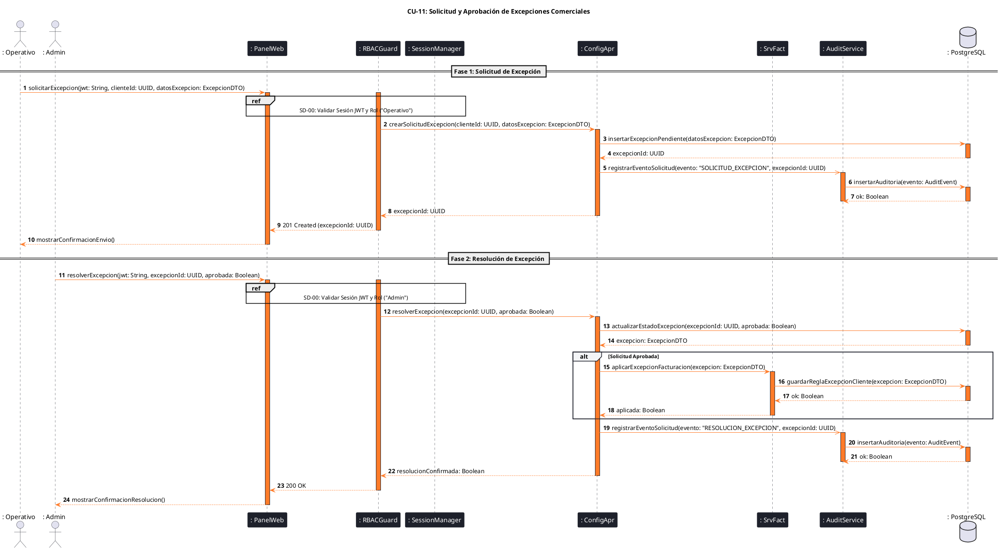

# CU-11: Solicitud y Aprobación de Excepciones Comerciales

```plantuml
@startuml

title CU-11: Solicitud y Aprobación de Excepciones Comerciales

autonumber

skinparam sequence {

    ArrowColor #FF7B29

    LifeLineBorderColor #1E212B

    LifeLineBackgroundColor #FF7B29

    ActorBorderColor #1E212B

    ParticipantBorderColor #1E212B

    ParticipantBackgroundColor #1E212B

    ParticipantFontColor #FFFFFF

    DatabaseBorderColor #1E212B

    DatabaseBackgroundColor #1E212B

    DatabaseFontColor #FFFFFF

    GroupBorderColor #1E212B

    GroupBackgroundColor #F4F5F7

}

actor ": Operativo" as Op

actor ": Admin" as Admin

participant ": PanelWeb" as FE

participant ": RBACGuard" as RBAC

participant ": SessionManager" as SessionMgr

participant ": ConfigApr" as ConfigApr

participant ": SrvFact" as SrvFact

participant ": AuditService" as AuditSvc

database ": PostgreSQL" as DB

== Fase 1: Solicitud de Excepción ==

Op -> FE : solicitarExcepcion(jwt: String, clienteId: UUID, datosExcepcion: ExcepcionDTO)

activate FE

ref over FE, SessionMgr : SD-00: Validar Sesión JWT y Rol ("Operativo")

activate RBAC

RBAC -> ConfigApr : crearSolicitudExcepcion(clienteId: UUID, datosExcepcion: ExcepcionDTO)

activate ConfigApr

ConfigApr -> DB : insertarExcepcionPendiente(datosExcepcion: ExcepcionDTO)

activate DB

DB --> ConfigApr : excepcionId: UUID

deactivate DB

ConfigApr ->> AuditSvc : registrarEventoSolicitud(evento: "SOLICITUD_EXCEPCION", excepcionId: UUID)

activate AuditSvc

AuditSvc -> DB : insertarAuditoria(evento: AuditEvent)

activate DB

DB --> AuditSvc : ok: Boolean

deactivate DB

deactivate AuditSvc

ConfigApr --> RBAC : excepcionId: UUID

deactivate ConfigApr

RBAC --> FE : 201 Created (excepcionId: UUID)

deactivate RBAC

FE --> Op : mostrarConfirmacionEnvio()

deactivate FE

== Fase 2: Resolución de Excepción ==

Admin -> FE : resolverExcepcion(jwt: String, excepcionId: UUID, aprobada: Boolean)

activate FE

ref over FE, SessionMgr : SD-00: Validar Sesión JWT y Rol ("Admin")

activate RBAC

RBAC -> ConfigApr : resolverExcepcion(excepcionId: UUID, aprobada: Boolean)

activate ConfigApr

ConfigApr -> DB : actualizarEstadoExcepcion(excepcionId: UUID, aprobada: Boolean)

activate DB

DB --> ConfigApr : excepcion: ExcepcionDTO

deactivate DB

alt Solicitud Aprobada

    ConfigApr -> SrvFact : aplicarExcepcionFacturacion(excepcion: ExcepcionDTO)

    activate SrvFact

    SrvFact -> DB : guardarReglaExcepcionCliente(excepcion: ExcepcionDTO)

    activate DB

    DB --> SrvFact : ok: Boolean

    deactivate DB

    SrvFact --> ConfigApr : aplicada: Boolean

    deactivate SrvFact

end

ConfigApr ->> AuditSvc : registrarEventoSolicitud(evento: "RESOLUCION_EXCEPCION", excepcionId: UUID)

activate AuditSvc

AuditSvc -> DB : insertarAuditoria(evento: AuditEvent)

activate DB

DB --> AuditSvc : ok: Boolean

deactivate DB

deactivate AuditSvc

ConfigApr --> RBAC : resolucionConfirmada: Boolean

deactivate ConfigApr

RBAC --> FE : 200 OK

deactivate RBAC

FE --> Admin : mostrarConfirmacionResolucion()

deactivate FE

@enduml
```
