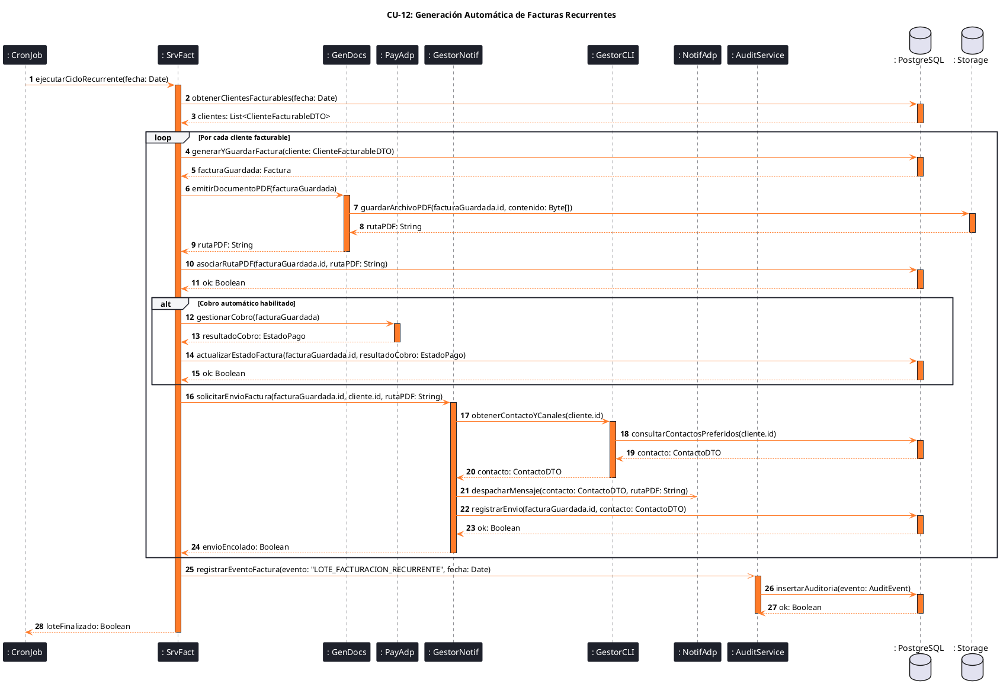

# CU-12: Generación Automática de Facturas Recurrentes

```plantuml
@startuml

title CU-12: Generación Automática de Facturas Recurrentes

autonumber

skinparam sequence {

    ArrowColor #FF7B29

    LifeLineBorderColor #1E212B

    LifeLineBackgroundColor #FF7B29

    ParticipantBorderColor #1E212B

    ParticipantBackgroundColor #1E212B

    ParticipantFontColor #FFFFFF

    DatabaseBorderColor #1E212B

    DatabaseBackgroundColor #1E212B

    DatabaseFontColor #FFFFFF

    GroupBorderColor #1E212B

    GroupBackgroundColor #F4F5F7

}

participant ": CronJob" as Cron

participant ": SrvFact" as SrvFact

participant ": GenDocs" as GenDocs

participant ": PayAdp" as PayAdp

participant ": GestorNotif" as GestorNotif

participant ": GestorCLI" as GestorCLI

participant ": NotifAdp" as NotifAdp

participant ": AuditService" as AuditSvc

database ": PostgreSQL" as DB

database ": Storage" as Storage

Cron -> SrvFact : ejecutarCicloRecurrente(fecha: Date)

activate SrvFact

SrvFact -> DB : obtenerClientesFacturables(fecha: Date)

activate DB

DB --> SrvFact : clientes: List<ClienteFacturableDTO>

deactivate DB

loop Por cada cliente facturable

    SrvFact -> DB : generarYGuardarFactura(cliente: ClienteFacturableDTO)

    activate DB

    DB --> SrvFact : facturaGuardada: Factura

    deactivate DB

    SrvFact -> GenDocs : emitirDocumentoPDF(facturaGuardada)

    activate GenDocs

    GenDocs -> Storage : guardarArchivoPDF(facturaGuardada.id, contenido: Byte[])

    activate Storage

    Storage --> GenDocs : rutaPDF: String

    deactivate Storage

    GenDocs --> SrvFact : rutaPDF: String

    deactivate GenDocs

    SrvFact -> DB : asociarRutaPDF(facturaGuardada.id, rutaPDF: String)

    activate DB

    DB --> SrvFact : ok: Boolean

    deactivate DB

    alt Cobro automático habilitado

        SrvFact -> PayAdp : gestionarCobro(facturaGuardada)

        activate PayAdp

        PayAdp --> SrvFact : resultadoCobro: EstadoPago

        deactivate PayAdp

        SrvFact -> DB : actualizarEstadoFactura(facturaGuardada.id, resultadoCobro: EstadoPago)

        activate DB

        DB --> SrvFact : ok: Boolean

        deactivate DB

    end

    SrvFact -> GestorNotif : solicitarEnvioFactura(facturaGuardada.id, cliente.id, rutaPDF: String)

    activate GestorNotif

    GestorNotif -> GestorCLI : obtenerContactoYCanales(cliente.id)

    activate GestorCLI

    GestorCLI -> DB : consultarContactosPreferidos(cliente.id)

    activate DB

    DB --> GestorCLI : contacto: ContactoDTO

    deactivate DB

    GestorCLI --> GestorNotif : contacto: ContactoDTO

    deactivate GestorCLI

    GestorNotif ->> NotifAdp : despacharMensaje(contacto: ContactoDTO, rutaPDF: String)

    GestorNotif -> DB : registrarEnvio(facturaGuardada.id, contacto: ContactoDTO)

    activate DB

    DB --> GestorNotif : ok: Boolean

    deactivate DB

    GestorNotif --> SrvFact : envioEncolado: Boolean

    deactivate GestorNotif

end

SrvFact ->> AuditSvc : registrarEventoFactura(evento: "LOTE_FACTURACION_RECURRENTE", fecha: Date)

activate AuditSvc

AuditSvc -> DB : insertarAuditoria(evento: AuditEvent)

activate DB

DB --> AuditSvc : ok: Boolean

deactivate DB

deactivate AuditSvc

SrvFact --> Cron : loteFinalizado: Boolean

deactivate SrvFact

@enduml
```
