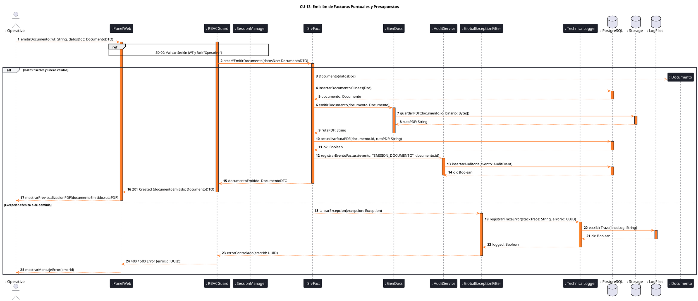

# CU-13: Emisión de Facturas Puntuales y Presupuestos

```plantuml
@startuml

title CU-13: Emisión de Facturas Puntuales y Presupuestos

autonumber

skinparam sequence {

    ArrowColor #FF7B29

    LifeLineBorderColor #1E212B

    LifeLineBackgroundColor #FF7B29

    ActorBorderColor #1E212B

    ParticipantBorderColor #1E212B

    ParticipantBackgroundColor #1E212B

    ParticipantFontColor #FFFFFF

    DatabaseBorderColor #1E212B

    DatabaseBackgroundColor #1E212B

    DatabaseFontColor #FFFFFF

    GroupBorderColor #1E212B

    GroupBackgroundColor #F4F5F7

}

actor ": Operativo" as Op

participant ": PanelWeb" as FE

participant ": RBACGuard" as RBAC

participant ": SessionManager" as SessionMgr

participant ": SrvFact" as SrvFact

participant ": GenDocs" as GenDocs

participant ": AuditService" as AuditSvc

participant ": GlobalExceptionFilter" as ExFilter

participant ": TechnicalLogger" as TechLog

database ": PostgreSQL" as DB

database ": Storage" as Storage

database ": LogFiles" as LogFiles

Op -> FE : emitirDocumento(jwt: String, datosDoc: DocumentoDTO)

activate FE

ref over FE, SessionMgr : SD-00: Validar Sesión JWT y Rol ("Operativo")

activate RBAC

RBAC -> SrvFact : crearYEmitirDocumento(datosDoc: DocumentoDTO)

activate SrvFact

alt Datos fiscales y líneas válidos

    create participant ": Documento" as Doc

    SrvFact -->> Doc : Documento(datosDoc)

    SrvFact -> DB : insertarDocumentoYLineas(Doc)

    activate DB

    DB --> SrvFact : documento: Documento

    deactivate DB

    SrvFact -> GenDocs : emitirDocumento(documento: Documento)

    activate GenDocs

    GenDocs -> Storage : guardarPDF(documento.id, binario: Byte[])

    activate Storage

    Storage --> GenDocs : rutaPDF: String

    deactivate Storage

    GenDocs --> SrvFact : rutaPDF: String

    deactivate GenDocs

    SrvFact -> DB : actualizarRutaPDF(documento.id, rutaPDF: String)

    activate DB

    DB --> SrvFact : ok: Boolean

    deactivate DB

    SrvFact ->> AuditSvc : registrarEventoFactura(evento: "EMISION_DOCUMENTO", documento.id)

    activate AuditSvc

    AuditSvc -> DB : insertarAuditoria(evento: AuditEvent)

    activate DB

    DB --> AuditSvc : ok: Boolean

    deactivate DB

    deactivate AuditSvc

    SrvFact --> RBAC : documentoEmitido: DocumentoDTO

    deactivate SrvFact

    RBAC --> FE : 201 Created (documentoEmitido: DocumentoDTO)

    deactivate RBAC

    FE --> Op : mostrarPrevisualizacionPDF(documentoEmitido.rutaPDF)

    deactivate FE

else Excepción técnica o de dominio

    SrvFact --> ExFilter : lanzarExcepcion(excepcion: Exception)

    deactivate SrvFact

    activate ExFilter

    ExFilter -> TechLog : registrarTrazaError(stackTrace: String, errorId: UUID)

    activate TechLog

    TechLog -> LogFiles : escribirTraza(lineaLog: String)

    activate LogFiles

    LogFiles --> TechLog : ok: Boolean

    deactivate LogFiles

    TechLog --> ExFilter : logged: Boolean

    deactivate TechLog

    ExFilter --> RBAC : errorControlado(errorId: UUID)

    deactivate ExFilter

    RBAC --> FE : 400 / 500 Error (errorId: UUID)

    deactivate RBAC

    FE --> Op : mostrarMensajeError(errorId)

    deactivate FE

end

@enduml
```
