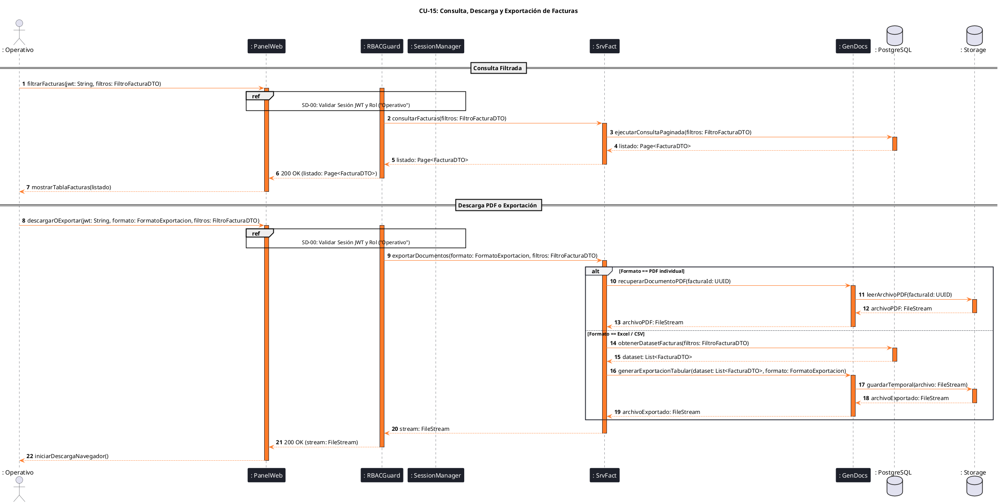

# CU-15: Consulta, Descarga y Exportación de Facturas

```plantuml
@startuml

title CU-15: Consulta, Descarga y Exportación de Facturas

autonumber

skinparam sequence {

    ArrowColor #FF7B29

    LifeLineBorderColor #1E212B

    LifeLineBackgroundColor #FF7B29

    ActorBorderColor #1E212B

    ParticipantBorderColor #1E212B

    ParticipantBackgroundColor #1E212B

    ParticipantFontColor #FFFFFF

    DatabaseBorderColor #1E212B

    DatabaseBackgroundColor #1E212B

    DatabaseFontColor #FFFFFF

    GroupBorderColor #1E212B

    GroupBackgroundColor #F4F5F7

}

actor ": Operativo" as Op

participant ": PanelWeb" as FE

participant ": RBACGuard" as RBAC

participant ": SessionManager" as SessionMgr

participant ": SrvFact" as SrvFact

participant ": GenDocs" as GenDocs

database ": PostgreSQL" as DB

database ": Storage" as Storage

== Consulta Filtrada ==

Op -> FE : filtrarFacturas(jwt: String, filtros: FiltroFacturaDTO)

activate FE

ref over FE, SessionMgr : SD-00: Validar Sesión JWT y Rol ("Operativo")

activate RBAC

RBAC -> SrvFact : consultarFacturas(filtros: FiltroFacturaDTO)

activate SrvFact

SrvFact -> DB : ejecutarConsultaPaginada(filtros: FiltroFacturaDTO)

activate DB

DB --> SrvFact : listado: Page<FacturaDTO>

deactivate DB

SrvFact --> RBAC : listado: Page<FacturaDTO>

deactivate SrvFact

RBAC --> FE : 200 OK (listado: Page<FacturaDTO>)

deactivate RBAC

FE --> Op : mostrarTablaFacturas(listado)

deactivate FE

== Descarga PDF o Exportación ==

Op -> FE : descargarOExportar(jwt: String, formato: FormatoExportacion, filtros: FiltroFacturaDTO)

activate FE

ref over FE, SessionMgr : SD-00: Validar Sesión JWT y Rol ("Operativo")

activate RBAC

RBAC -> SrvFact : exportarDocumentos(formato: FormatoExportacion, filtros: FiltroFacturaDTO)

activate SrvFact

alt Formato == PDF individual

    SrvFact -> GenDocs : recuperarDocumentoPDF(facturaId: UUID)

    activate GenDocs

    GenDocs -> Storage : leerArchivoPDF(facturaId: UUID)

    activate Storage

    Storage --> GenDocs : archivoPDF: FileStream

    deactivate Storage

    GenDocs --> SrvFact : archivoPDF: FileStream

    deactivate GenDocs

else Formato == Excel / CSV

    SrvFact -> DB : obtenerDatasetFacturas(filtros: FiltroFacturaDTO)

    activate DB

    DB --> SrvFact : dataset: List<FacturaDTO>

    deactivate DB

    SrvFact -> GenDocs : generarExportacionTabular(dataset: List<FacturaDTO>, formato: FormatoExportacion)

    activate GenDocs

    GenDocs -> Storage : guardarTemporal(archivo: FileStream)

    activate Storage

    Storage --> GenDocs : archivoExportado: FileStream

    deactivate Storage

    GenDocs --> SrvFact : archivoExportado: FileStream

    deactivate GenDocs

end

SrvFact --> RBAC : stream: FileStream

deactivate SrvFact

RBAC --> FE : 200 OK (stream: FileStream)

deactivate RBAC

FE --> Op : iniciarDescargaNavegador()

deactivate FE

@enduml
```
