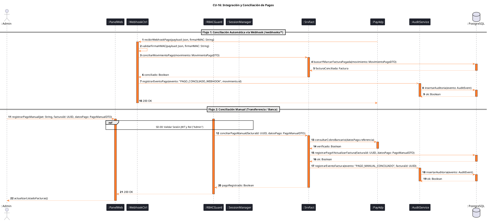

# CU-16: Integración y Conciliación de Pagos

```plantuml
@startuml

title CU-16: Integración y Conciliación de Pagos

autonumber

skinparam sequence {

    ArrowColor #FF7B29

    LifeLineBorderColor #1E212B

    LifeLineBackgroundColor #FF7B29

    ActorBorderColor #1E212B

    ParticipantBorderColor #1E212B

    ParticipantBackgroundColor #1E212B

    ParticipantFontColor #FFFFFF

    DatabaseBorderColor #1E212B

    DatabaseBackgroundColor #1E212B

    DatabaseFontColor #FFFFFF

    GroupBorderColor #1E212B

    GroupBackgroundColor #F4F5F7

}

actor ": Admin" as Admin

participant ": PanelWeb" as FE

participant ": WebhookCtrl" as WebhookCtrl

participant ": RBACGuard" as RBAC

participant ": SessionManager" as SessionMgr

participant ": SrvFact" as SrvFact

participant ": PayAdp" as PayAdp

participant ": AuditService" as AuditSvc

database ": PostgreSQL" as DB

== Flujo 1: Conciliación Automática vía Webhook (/webhooks/*) ==

PayAdp -> WebhookCtrl : recibirWebhookPago(payload: Json, firmaHMAC: String)

activate WebhookCtrl

WebhookCtrl -> WebhookCtrl : validarFirmaHMAC(payload: Json, firmaHMAC: String)

WebhookCtrl -> SrvFact : conciliarMovimientoPago(movimiento: MovimientoPagoDTO)

activate SrvFact

SrvFact -> DB : buscarYMarcarFacturaPagada(movimiento: MovimientoPagoDTO)

activate DB

DB --> SrvFact : facturaConciliada: Factura

deactivate DB

SrvFact --> WebhookCtrl : conciliado: Boolean

deactivate SrvFact

WebhookCtrl ->> AuditSvc : registrarEventoPago(evento: "PAGO_CONCILIADO_WEBHOOK", movimiento.id)

activate AuditSvc

AuditSvc -> DB : insertarAuditoria(evento: AuditEvent)

activate DB

DB --> AuditSvc : ok: Boolean

deactivate DB

deactivate AuditSvc

WebhookCtrl --> PayAdp : 200 OK

deactivate WebhookCtrl

== Flujo 2: Conciliación Manual (Transferencia / Banca) ==

Admin -> FE : registrarPagoManual(jwt: String, facturaId: UUID, datosPago: PagoManualDTO)

activate FE

ref over FE, SessionMgr : SD-00: Validar Sesión JWT y Rol ("Admin")

activate RBAC

RBAC -> SrvFact : conciliarPagoManual(facturaId: UUID, datosPago: PagoManualDTO)

activate SrvFact

SrvFact -> PayAdp : consultarCobroBancario(datosPago.referencia)

activate PayAdp

PayAdp --> SrvFact : verificado: Boolean

deactivate PayAdp

SrvFact -> DB : registrarPagoYActualizarFactura(facturaId: UUID, datosPago: PagoManualDTO)

activate DB

DB --> SrvFact : ok: Boolean

deactivate DB

SrvFact ->> AuditSvc : registrarEventoFactura(evento: "PAGO_MANUAL_CONCILIADO", facturaId: UUID)

activate AuditSvc

AuditSvc -> DB : insertarAuditoria(evento: AuditEvent)

activate DB

DB --> AuditSvc : ok: Boolean

deactivate DB

deactivate AuditSvc

SrvFact --> RBAC : pagoRegistrado: Boolean

deactivate SrvFact

RBAC --> FE : 200 OK

deactivate RBAC

FE --> Admin : actualizarListadoFacturas()

deactivate FE

@enduml
```
