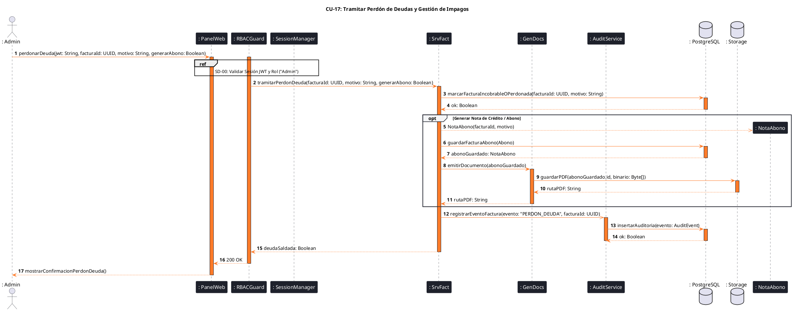

# CU-17: Tramitar Perdón de Deudas y Gestión de Impagos

```plantuml
@startuml

title CU-17: Tramitar Perdón de Deudas y Gestión de Impagos

autonumber

skinparam sequence {

    ArrowColor #FF7B29

    LifeLineBorderColor #1E212B

    LifeLineBackgroundColor #FF7B29

    ActorBorderColor #1E212B

    ParticipantBorderColor #1E212B

    ParticipantBackgroundColor #1E212B

    ParticipantFontColor #FFFFFF

    DatabaseBorderColor #1E212B

    DatabaseBackgroundColor #1E212B

    DatabaseFontColor #FFFFFF

    GroupBorderColor #1E212B

    GroupBackgroundColor #F4F5F7

}

actor ": Admin" as Admin

participant ": PanelWeb" as FE

participant ": RBACGuard" as RBAC

participant ": SessionManager" as SessionMgr

participant ": SrvFact" as SrvFact

participant ": GenDocs" as GenDocs

participant ": AuditService" as AuditSvc

database ": PostgreSQL" as DB

database ": Storage" as Storage

Admin -> FE : perdonarDeuda(jwt: String, facturaId: UUID, motivo: String, generarAbono: Boolean)

activate FE

ref over FE, SessionMgr : SD-00: Validar Sesión JWT y Rol ("Admin")

activate RBAC

RBAC -> SrvFact : tramitarPerdonDeuda(facturaId: UUID, motivo: String, generarAbono: Boolean)

activate SrvFact

SrvFact -> DB : marcarFacturaIncobrableOPerdonada(facturaId: UUID, motivo: String)

activate DB

DB --> SrvFact : ok: Boolean

deactivate DB

opt Generar Nota de Crédito / Abono

    create participant ": NotaAbono" as Abono

    SrvFact -->> Abono : NotaAbono(facturaId, motivo)

    SrvFact -> DB : guardarFacturaAbono(Abono)

    activate DB

    DB --> SrvFact : abonoGuardado: NotaAbono

    deactivate DB

    SrvFact -> GenDocs : emitirDocumento(abonoGuardado)

    activate GenDocs

    GenDocs -> Storage : guardarPDF(abonoGuardado.id, binario: Byte[])

    activate Storage

    Storage --> GenDocs : rutaPDF: String

    deactivate Storage

    GenDocs --> SrvFact : rutaPDF: String

    deactivate GenDocs

end

SrvFact ->> AuditSvc : registrarEventoFactura(evento: "PERDON_DEUDA", facturaId: UUID)

activate AuditSvc

AuditSvc -> DB : insertarAuditoria(evento: AuditEvent)

activate DB

DB --> AuditSvc : ok: Boolean

deactivate DB

deactivate AuditSvc

SrvFact --> RBAC : deudaSaldada: Boolean

deactivate SrvFact

RBAC --> FE : 200 OK

deactivate RBAC

FE --> Admin : mostrarConfirmacionPerdonDeuda()

deactivate FE

@enduml
```
