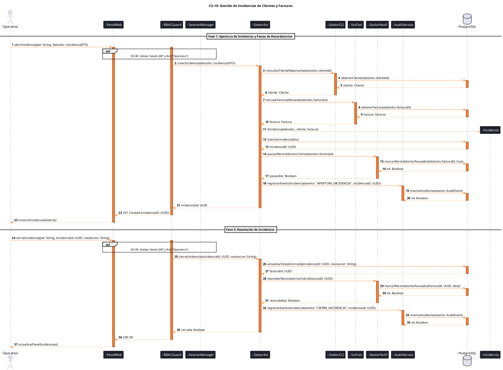

# CU-18: Gestión de Incidencias de Clientes y Facturas

```plantuml
@startuml

title CU-18: Gestión de Incidencias de Clientes y Facturas

autonumber

skinparam sequence {

    ArrowColor #FF7B29

    LifeLineBorderColor #1E212B

    LifeLineBackgroundColor #FF7B29

    ActorBorderColor #1E212B

    ParticipantBorderColor #1E212B

    ParticipantBackgroundColor #1E212B

    ParticipantFontColor #FFFFFF

    DatabaseBorderColor #1E212B

    DatabaseBackgroundColor #1E212B

    DatabaseFontColor #FFFFFF

    GroupBorderColor #1E212B

    GroupBackgroundColor #F4F5F7

}

actor ": Operativo" as Op

participant ": PanelWeb" as FE

participant ": RBACGuard" as RBAC

participant ": SessionManager" as SessionMgr

participant ": GestorInc" as GestorInc

participant ": GestorCLI" as GestorCLI

participant ": SrvFact" as SrvFact

participant ": GestorNotif" as GestorNotif

participant ": AuditService" as AuditSvc

database ": PostgreSQL" as DB

== Fase 1: Apertura de Incidencia y Pausa de Recordatorios ==

Op -> FE : abrirIncidencia(jwt: String, datosInc: IncidenciaDTO)

activate FE

ref over FE, SessionMgr : SD-00: Validar Sesión JWT y Rol ("Operativo")

activate RBAC

RBAC -> GestorInc : crearIncidencia(datosInc: IncidenciaDTO)

activate GestorInc

GestorInc -> GestorCLI : consultarClienteReportante(datosInc.clienteId)

activate GestorCLI

GestorCLI -> DB : obtenerCliente(datosInc.clienteId)

activate DB

DB --> GestorCLI : cliente: Cliente

deactivate DB

GestorCLI --> GestorInc : cliente: Cliente

deactivate GestorCLI

GestorInc -> SrvFact : vincularFacturaAfectada(datosInc.facturaId)

activate SrvFact

SrvFact -> DB : obtenerFactura(datosInc.facturaId)

activate DB

DB --> SrvFact : factura: Factura

deactivate DB

SrvFact --> GestorInc : factura: Factura

deactivate SrvFact

create participant ": Incidencia" as Inc

GestorInc -->> Inc : Incidencia(datosInc, cliente, factura)

GestorInc -> DB : insertarIncidencia(Inc)

activate DB

DB --> GestorInc : incidenciaId: UUID

deactivate DB

GestorInc -> GestorNotif : pausarRecordatoriosCobro(datosInc.facturaId)

activate GestorNotif

GestorNotif -> DB : marcarRecordatoriosPausados(datosInc.facturaId, true)

activate DB

DB --> GestorNotif : ok: Boolean

deactivate DB

GestorNotif --> GestorInc : pausados: Boolean

deactivate GestorNotif

GestorInc ->> AuditSvc : registrarEventoIncidencia(evento: "APERTURA_INCIDENCIA", incidenciaId: UUID)

activate AuditSvc

AuditSvc -> DB : insertarAuditoria(evento: AuditEvent)

activate DB

DB --> AuditSvc : ok: Boolean

deactivate DB

deactivate AuditSvc

GestorInc --> RBAC : incidenciaId: UUID

deactivate GestorInc

RBAC --> FE : 201 Created (incidenciaId: UUID)

deactivate RBAC

FE --> Op : mostrarIncidenciaAbierta()

deactivate FE

== Fase 2: Resolución de Incidencia ==

Op -> FE : cerrarIncidencia(jwt: String, incidenciaId: UUID, resolucion: String)

activate FE

ref over FE, SessionMgr : SD-00: Validar Sesión JWT y Rol ("Operativo")

activate RBAC

RBAC -> GestorInc : cerrarIncidencia(incidenciaId: UUID, resolucion: String)

activate GestorInc

GestorInc -> DB : actualizarEstadoCerrada(incidenciaId: UUID, resolucion: String)

activate DB

DB --> GestorInc : facturaId: UUID

deactivate DB

GestorInc -> GestorNotif : reanudarRecordatoriosCobro(facturaId: UUID)

activate GestorNotif

GestorNotif -> DB : marcarRecordatoriosPausados(facturaId: UUID, false)

activate DB

DB --> GestorNotif : ok: Boolean

deactivate DB

GestorNotif --> GestorInc : reanudados: Boolean

deactivate GestorNotif

GestorInc ->> AuditSvc : registrarEventoIncidencia(evento: "CIERRE_INCIDENCIA", incidenciaId: UUID)

activate AuditSvc

AuditSvc -> DB : insertarAuditoria(evento: AuditEvent)

activate DB

DB --> AuditSvc : ok: Boolean

deactivate DB

deactivate AuditSvc

GestorInc --> RBAC : cerrada: Boolean

deactivate GestorInc

RBAC --> FE : 200 OK

deactivate RBAC

FE --> Op : actualizarPanelIncidencias()

deactivate FE

@enduml
```
