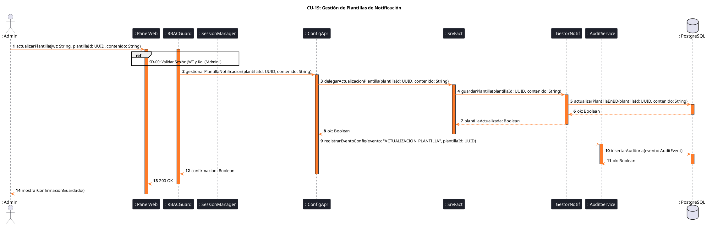

# CU-19: Gestión de Plantillas de Notificación

```plantuml
@startuml

title CU-19: Gestión de Plantillas de Notificación

autonumber

skinparam sequence {

    ArrowColor #FF7B29

    LifeLineBorderColor #1E212B

    LifeLineBackgroundColor #FF7B29

    ActorBorderColor #1E212B

    ParticipantBorderColor #1E212B

    ParticipantBackgroundColor #1E212B

    ParticipantFontColor #FFFFFF

    DatabaseBorderColor #1E212B

    DatabaseBackgroundColor #1E212B

    DatabaseFontColor #FFFFFF

    GroupBorderColor #1E212B

    GroupBackgroundColor #F4F5F7

}

actor ": Admin" as Admin

participant ": PanelWeb" as FE

participant ": RBACGuard" as RBAC

participant ": SessionManager" as SessionMgr

participant ": ConfigApr" as ConfigApr

participant ": SrvFact" as SrvFact

participant ": GestorNotif" as GestorNotif

participant ": AuditService" as AuditSvc

database ": PostgreSQL" as DB

Admin -> FE : actualizarPlantilla(jwt: String, plantillaId: UUID, contenido: String)

activate FE

ref over FE, SessionMgr : SD-00: Validar Sesión JWT y Rol ("Admin")

activate RBAC

RBAC -> ConfigApr : gestionarPlantillaNotificacion(plantillaId: UUID, contenido: String)

activate ConfigApr

ConfigApr -> SrvFact : delegarActualizacionPlantilla(plantillaId: UUID, contenido: String)

activate SrvFact

SrvFact -> GestorNotif : guardarPlantilla(plantillaId: UUID, contenido: String)

activate GestorNotif

GestorNotif -> DB : actualizarPlantillaEnBD(plantillaId: UUID, contenido: String)

activate DB

DB --> GestorNotif : ok: Boolean

deactivate DB

GestorNotif --> SrvFact : plantillaActualizada: Boolean

deactivate GestorNotif

SrvFact --> ConfigApr : ok: Boolean

deactivate SrvFact

ConfigApr ->> AuditSvc : registrarEventoConfig(evento: "ACTUALIZACION_PLANTILLA", plantillaId: UUID)

activate AuditSvc

AuditSvc -> DB : insertarAuditoria(evento: AuditEvent)

activate DB

DB --> AuditSvc : ok: Boolean

deactivate DB

deactivate AuditSvc

ConfigApr --> RBAC : confirmacion: Boolean

deactivate ConfigApr

RBAC --> FE : 200 OK

deactivate RBAC

FE --> Admin : mostrarConfirmacionGuardado()

deactivate FE

@enduml
```
