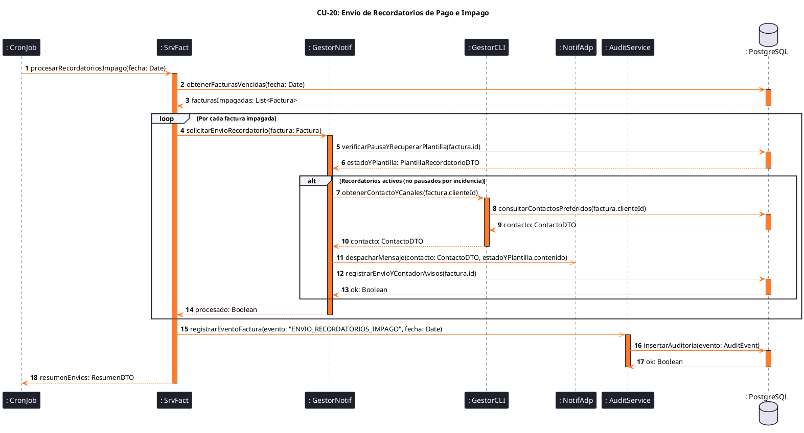

# CU-20: Envío de Recordatorios de Pago e Impago

```plantuml
@startuml

title CU-20: Envío de Recordatorios de Pago e Impago

autonumber

skinparam sequence {

    ArrowColor #FF7B29

    LifeLineBorderColor #1E212B

    LifeLineBackgroundColor #FF7B29

    ParticipantBorderColor #1E212B

    ParticipantBackgroundColor #1E212B

    ParticipantFontColor #FFFFFF

    DatabaseBorderColor #1E212B

    DatabaseBackgroundColor #1E212B

    DatabaseFontColor #FFFFFF

    GroupBorderColor #1E212B

    GroupBackgroundColor #F4F5F7

}

participant ": CronJob" as Cron

participant ": SrvFact" as SrvFact

participant ": GestorNotif" as GestorNotif

participant ": GestorCLI" as GestorCLI

participant ": NotifAdp" as NotifAdp

participant ": AuditService" as AuditSvc

database ": PostgreSQL" as DB

Cron -> SrvFact : procesarRecordatoriosImpago(fecha: Date)

activate SrvFact

SrvFact -> DB : obtenerFacturasVencidas(fecha: Date)

activate DB

DB --> SrvFact : facturasImpagadas: List<Factura>

deactivate DB

loop Por cada factura impagada

    SrvFact -> GestorNotif : solicitarEnvioRecordatorio(factura: Factura)

    activate GestorNotif

    GestorNotif -> DB : verificarPausaYRecuperarPlantilla(factura.id)

    activate DB

    DB --> GestorNotif : estadoYPlantilla: PlantillaRecordatorioDTO

    deactivate DB

    alt Recordatorios activos (no pausados por incidencia)

        GestorNotif -> GestorCLI : obtenerContactoYCanales(factura.clienteId)

        activate GestorCLI

        GestorCLI -> DB : consultarContactosPreferidos(factura.clienteId)

        activate DB

        DB --> GestorCLI : contacto: ContactoDTO

        deactivate DB

        GestorCLI --> GestorNotif : contacto: ContactoDTO

        deactivate GestorCLI

        GestorNotif ->> NotifAdp : despacharMensaje(contacto: ContactoDTO, estadoYPlantilla.contenido)

        GestorNotif -> DB : registrarEnvioYContadorAvisos(factura.id)

        activate DB

        DB --> GestorNotif : ok: Boolean

        deactivate DB

    end

    GestorNotif --> SrvFact : procesado: Boolean

    deactivate GestorNotif

end

SrvFact ->> AuditSvc : registrarEventoFactura(evento: "ENVIO_RECORDATORIOS_IMPAGO", fecha: Date)

activate AuditSvc

AuditSvc -> DB : insertarAuditoria(evento: AuditEvent)

activate DB

DB --> AuditSvc : ok: Boolean

deactivate DB

deactivate AuditSvc

SrvFact --> Cron : resumenEnvios: ResumenDTO

deactivate SrvFact

@enduml
```
