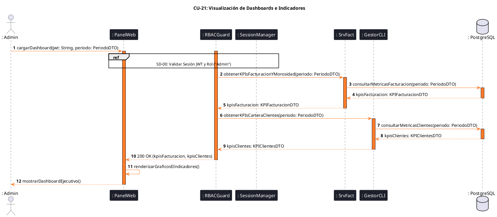

# CU-21: Visualización de Dashboards e Indicadores

```plantuml
@startuml

title CU-21: Visualización de Dashboards e Indicadores

autonumber

skinparam sequence {

    ArrowColor #FF7B29

    LifeLineBorderColor #1E212B

    LifeLineBackgroundColor #FF7B29

    ActorBorderColor #1E212B

    ParticipantBorderColor #1E212B

    ParticipantBackgroundColor #1E212B

    ParticipantFontColor #FFFFFF

    DatabaseBorderColor #1E212B

    DatabaseBackgroundColor #1E212B

    DatabaseFontColor #FFFFFF

    GroupBorderColor #1E212B

    GroupBackgroundColor #F4F5F7

}

actor ": Admin" as Admin

participant ": PanelWeb" as FE

participant ": RBACGuard" as RBAC

participant ": SessionManager" as SessionMgr

participant ": SrvFact" as SrvFact

participant ": GestorCLI" as GestorCLI

database ": PostgreSQL" as DB

Admin -> FE : cargarDashboard(jwt: String, periodo: PeriodoDTO)

activate FE

ref over FE, SessionMgr : SD-00: Validar Sesión JWT y Rol ("Admin")

activate RBAC

RBAC -> SrvFact : obtenerKPIsFacturacionYMorosidad(periodo: PeriodoDTO)

activate SrvFact

SrvFact -> DB : consultarMetricasFacturacion(periodo: PeriodoDTO)

activate DB

DB --> SrvFact : kpisFacturacion: KPIFacturacionDTO

deactivate DB

SrvFact --> RBAC : kpisFacturacion: KPIFacturacionDTO

deactivate SrvFact

RBAC -> GestorCLI : obtenerKPIsCarteraClientes(periodo: PeriodoDTO)

activate GestorCLI

GestorCLI -> DB : consultarMetricasClientes(periodo: PeriodoDTO)

activate DB

DB --> GestorCLI : kpisClientes: KPIClientesDTO

deactivate DB

GestorCLI --> RBAC : kpisClientes: KPIClientesDTO

deactivate GestorCLI

RBAC --> FE : 200 OK (kpisFacturacion, kpisClientes)

deactivate RBAC

FE -> FE : renderizarGraficosEIndicadores()

FE --> Admin : mostrarDashboardEjecutivo()

deactivate FE

@enduml
```
