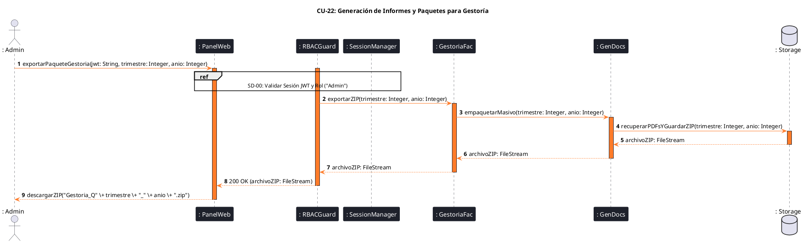

# CU-22: Generación de Informes y Paquetes para Gestoría

```plantuml
@startuml

title CU-22: Generación de Informes y Paquetes para Gestoría

autonumber

skinparam sequence {

    ArrowColor #FF7B29

    LifeLineBorderColor #1E212B

    LifeLineBackgroundColor #FF7B29

    ActorBorderColor #1E212B

    ParticipantBorderColor #1E212B

    ParticipantBackgroundColor #1E212B

    ParticipantFontColor #FFFFFF

    DatabaseBorderColor #1E212B

    DatabaseBackgroundColor #1E212B

    DatabaseFontColor #FFFFFF

    GroupBorderColor #1E212B

    GroupBackgroundColor #F4F5F7

}

actor ": Admin" as Admin

participant ": PanelWeb" as FE

participant ": RBACGuard" as RBAC

participant ": SessionManager" as SessionMgr

participant ": GestoriaFac" as GestoriaFac

participant ": GenDocs" as GenDocs

database ": Storage" as Storage

Admin -> FE : exportarPaqueteGestoria(jwt: String, trimestre: Integer, anio: Integer)

activate FE

ref over FE, SessionMgr : SD-00: Validar Sesión JWT y Rol ("Admin")

activate RBAC

RBAC -> GestoriaFac : exportarZIP(trimestre: Integer, anio: Integer)

activate GestoriaFac

GestoriaFac -> GenDocs : empaquetarMasivo(trimestre: Integer, anio: Integer)

activate GenDocs

GenDocs -> Storage : recuperarPDFsYGuardarZIP(trimestre: Integer, anio: Integer)

activate Storage

Storage --> GenDocs : archivoZIP: FileStream

deactivate Storage

GenDocs --> GestoriaFac : archivoZIP: FileStream

deactivate GenDocs

GestoriaFac --> RBAC : archivoZIP: FileStream

deactivate GestoriaFac

RBAC --> FE : 200 OK (archivoZIP: FileStream)

deactivate RBAC

FE --> Admin : descargarZIP("Gestoria_Q" \+ trimestre \+ "_" \+ anio \+ ".zip")

deactivate FE

@enduml
```
