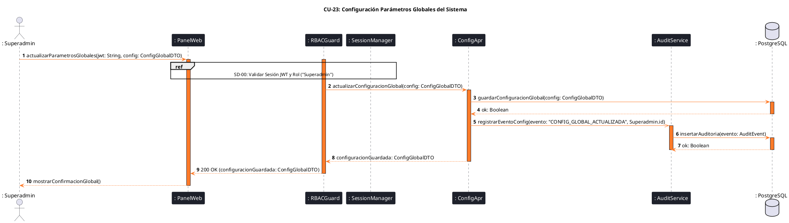

# CU-23: Configuración Parámetros Globales del Sistema

```plantuml
@startuml

title CU-23: Configuración Parámetros Globales del Sistema

autonumber

skinparam sequence {

    ArrowColor #FF7B29

    LifeLineBorderColor #1E212B

    LifeLineBackgroundColor #FF7B29

    ActorBorderColor #1E212B

    ParticipantBorderColor #1E212B

    ParticipantBackgroundColor #1E212B

    ParticipantFontColor #FFFFFF

    DatabaseBorderColor #1E212B

    DatabaseBackgroundColor #1E212B

    DatabaseFontColor #FFFFFF

    GroupBorderColor #1E212B

    GroupBackgroundColor #F4F5F7

}

actor ": Superadmin" as Superadmin

participant ": PanelWeb" as FE

participant ": RBACGuard" as RBAC

participant ": SessionManager" as SessionMgr

participant ": ConfigApr" as ConfigApr

participant ": AuditService" as AuditSvc

database ": PostgreSQL" as DB

Superadmin -> FE : actualizarParametrosGlobales(jwt: String, config: ConfigGlobalDTO)

activate FE

ref over FE, SessionMgr : SD-00: Validar Sesión JWT y Rol ("Superadmin")

activate RBAC

RBAC -> ConfigApr : actualizarConfiguracionGlobal(config: ConfigGlobalDTO)

activate ConfigApr

ConfigApr -> DB : guardarConfiguracionGlobal(config: ConfigGlobalDTO)

activate DB

DB --> ConfigApr : ok: Boolean

deactivate DB

ConfigApr ->> AuditSvc : registrarEventoConfig(evento: "CONFIG_GLOBAL_ACTUALIZADA", Superadmin.id)

activate AuditSvc

AuditSvc -> DB : insertarAuditoria(evento: AuditEvent)

activate DB

DB --> AuditSvc : ok: Boolean

deactivate DB

deactivate AuditSvc

ConfigApr --> RBAC : configuracionGuardada: ConfigGlobalDTO

deactivate ConfigApr

RBAC --> FE : 200 OK (configuracionGuardada: ConfigGlobalDTO)

deactivate RBAC

FE --> Superadmin : mostrarConfirmacionGlobal()

deactivate FE

@enduml
```
