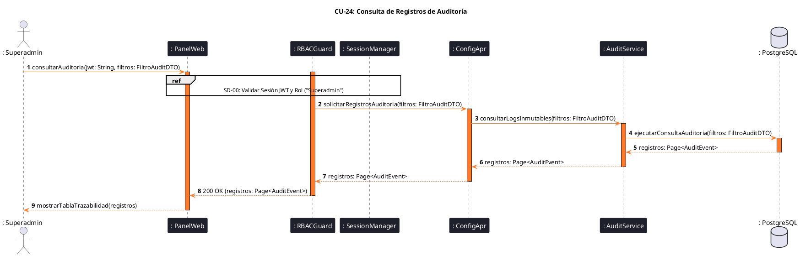

# CU-24: Consulta de Registros de Auditoría

```plantuml
@startuml

title CU-24: Consulta de Registros de Auditoría

autonumber

skinparam sequence {

    ArrowColor #FF7B29

    LifeLineBorderColor #1E212B

    LifeLineBackgroundColor #FF7B29

    ActorBorderColor #1E212B

    ParticipantBorderColor #1E212B

    ParticipantBackgroundColor #1E212B

    ParticipantFontColor #FFFFFF

    DatabaseBorderColor #1E212B

    DatabaseBackgroundColor #1E212B

    DatabaseFontColor #FFFFFF

    GroupBorderColor #1E212B

    GroupBackgroundColor #F4F5F7

}

actor ": Superadmin" as Superadmin

participant ": PanelWeb" as FE

participant ": RBACGuard" as RBAC

participant ": SessionManager" as SessionMgr

participant ": ConfigApr" as ConfigApr

participant ": AuditService" as AuditSvc

database ": PostgreSQL" as DB

Superadmin -> FE : consultarAuditoria(jwt: String, filtros: FiltroAuditDTO)

activate FE

ref over FE, SessionMgr : SD-00: Validar Sesión JWT y Rol ("Superadmin")

activate RBAC

RBAC -> ConfigApr : solicitarRegistrosAuditoria(filtros: FiltroAuditDTO)

activate ConfigApr

ConfigApr -> AuditSvc : consultarLogsInmutables(filtros: FiltroAuditDTO)

activate AuditSvc

AuditSvc -> DB : ejecutarConsultaAuditoria(filtros: FiltroAuditDTO)

activate DB

DB --> AuditSvc : registros: Page<AuditEvent>

deactivate DB

AuditSvc --> ConfigApr : registros: Page<AuditEvent>

deactivate AuditSvc

ConfigApr --> RBAC : registros: Page<AuditEvent>

deactivate ConfigApr

RBAC --> FE : 200 OK (registros: Page<AuditEvent>)

deactivate RBAC

FE --> Superadmin : mostrarTablaTrazabilidad(registros)

deactivate FE

@enduml
```
