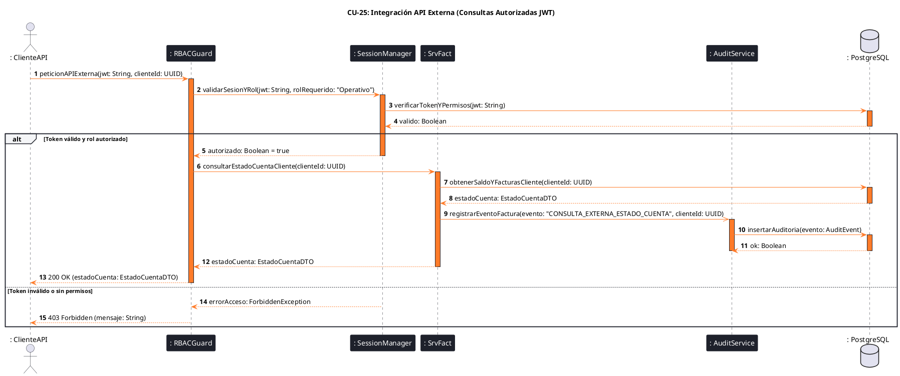

# CU-25: Integración API Externa (Consultas Autorizadas JWT)

```plantuml
@startuml

title CU-25: Integración API Externa (Consultas Autorizadas JWT)

autonumber

skinparam sequence {

    ArrowColor #FF7B29

    LifeLineBorderColor #1E212B

    LifeLineBackgroundColor #FF7B29

    ActorBorderColor #1E212B

    ParticipantBorderColor #1E212B

    ParticipantBackgroundColor #1E212B

    ParticipantFontColor #FFFFFF

    DatabaseBorderColor #1E212B

    DatabaseBackgroundColor #1E212B

    DatabaseFontColor #FFFFFF

    GroupBorderColor #1E212B

    GroupBackgroundColor #F4F5F7

}

actor ": ClienteAPI" as Ext

participant ": RBACGuard" as RBAC

participant ": SessionManager" as SessionMgr

participant ": SrvFact" as SrvFact

participant ": AuditService" as AuditSvc

database ": PostgreSQL" as DB

Ext -> RBAC : peticionAPIExterna(jwt: String, clienteId: UUID)

activate RBAC

RBAC -> SessionMgr : validarSesionYRol(jwt: String, rolRequerido: "Operativo")

activate SessionMgr

SessionMgr -> DB : verificarTokenYPermisos(jwt: String)

activate DB

DB --> SessionMgr : valido: Boolean

deactivate DB

alt Token válido y rol autorizado

    SessionMgr --> RBAC : autorizado: Boolean = true

    deactivate SessionMgr

    RBAC -> SrvFact : consultarEstadoCuentaCliente(clienteId: UUID)

    activate SrvFact

    SrvFact -> DB : obtenerSaldoYFacturasCliente(clienteId: UUID)

    activate DB

    DB --> SrvFact : estadoCuenta: EstadoCuentaDTO

    deactivate DB

    SrvFact ->> AuditSvc : registrarEventoFactura(evento: "CONSULTA_EXTERNA_ESTADO_CUENTA", clienteId: UUID)

    activate AuditSvc

    AuditSvc -> DB : insertarAuditoria(evento: AuditEvent)

    activate DB

    DB --> AuditSvc : ok: Boolean

    deactivate DB

    deactivate AuditSvc

    SrvFact --> RBAC : estadoCuenta: EstadoCuentaDTO

    deactivate SrvFact

    RBAC --> Ext : 200 OK (estadoCuenta: EstadoCuentaDTO)

    deactivate RBAC

else Token inválido o sin permisos

    SessionMgr --> RBAC : errorAcceso: ForbiddenException

    deactivate SessionMgr

    RBAC --> Ext : 403 Forbidden (mensaje: String)

    deactivate RBAC

end

@enduml
```
