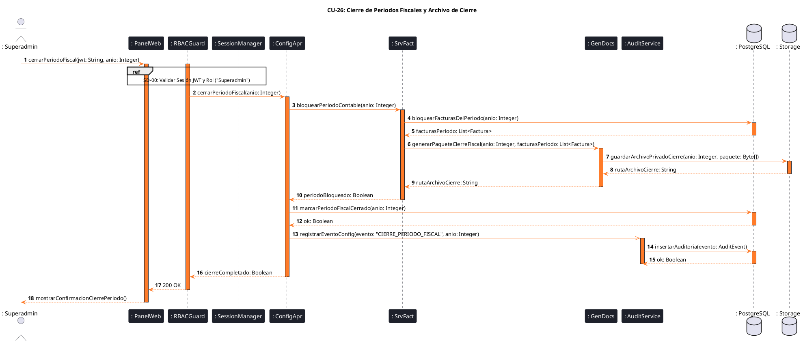

# CU-26: Cierre de Periodos Fiscales y Archivo de Cierre

```plantuml
@startuml

title CU-26: Cierre de Periodos Fiscales y Archivo de Cierre

autonumber

skinparam sequence {

    ArrowColor #FF7B29

    LifeLineBorderColor #1E212B

    LifeLineBackgroundColor #FF7B29

    ActorBorderColor #1E212B

    ParticipantBorderColor #1E212B

    ParticipantBackgroundColor #1E212B

    ParticipantFontColor #FFFFFF

    DatabaseBorderColor #1E212B

    DatabaseBackgroundColor #1E212B

    DatabaseFontColor #FFFFFF

    GroupBorderColor #1E212B

    GroupBackgroundColor #F4F5F7

}

actor ": Superadmin" as Superadmin

participant ": PanelWeb" as FE

participant ": RBACGuard" as RBAC

participant ": SessionManager" as SessionMgr

participant ": ConfigApr" as ConfigApr

participant ": SrvFact" as SrvFact

participant ": GenDocs" as GenDocs

participant ": AuditService" as AuditSvc

database ": PostgreSQL" as DB

database ": Storage" as Storage

Superadmin -> FE : cerrarPeriodoFiscal(jwt: String, anio: Integer)

activate FE

ref over FE, SessionMgr : SD-00: Validar Sesión JWT y Rol ("Superadmin")

activate RBAC

RBAC -> ConfigApr : cerrarPeriodoFiscal(anio: Integer)

activate ConfigApr

ConfigApr -> SrvFact : bloquearPeriodoContable(anio: Integer)

activate SrvFact

SrvFact -> DB : bloquearFacturasDelPeriodo(anio: Integer)

activate DB

DB --> SrvFact : facturasPeriodo: List<Factura>

deactivate DB

SrvFact -> GenDocs : generarPaqueteCierreFiscal(anio: Integer, facturasPeriodo: List<Factura>)

activate GenDocs

GenDocs -> Storage : guardarArchivoPrivadoCierre(anio: Integer, paquete: Byte[])

activate Storage

Storage --> GenDocs : rutaArchivoCierre: String

deactivate Storage

GenDocs --> SrvFact : rutaArchivoCierre: String

deactivate GenDocs

SrvFact --> ConfigApr : periodoBloqueado: Boolean

deactivate SrvFact

ConfigApr -> DB : marcarPeriodoFiscalCerrado(anio: Integer)

activate DB

DB --> ConfigApr : ok: Boolean

deactivate DB

ConfigApr ->> AuditSvc : registrarEventoConfig(evento: "CIERRE_PERIODO_FISCAL", anio: Integer)

activate AuditSvc

AuditSvc -> DB : insertarAuditoria(evento: AuditEvent)

activate DB

DB --> AuditSvc : ok: Boolean

deactivate DB

deactivate AuditSvc

ConfigApr --> RBAC : cierreCompletado: Boolean

deactivate ConfigApr

RBAC --> FE : 200 OK

deactivate RBAC

FE --> Superadmin : mostrarConfirmacionCierrePeriodo()

deactivate FE

@enduml
```
