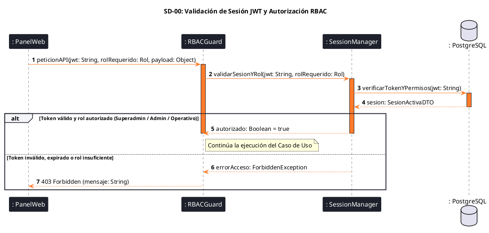

# SD-00: Validación de Sesión JWT y Autorización RBAC

```plantuml
@startuml

title SD-00: Validación de Sesión JWT y Autorización RBAC

autonumber

skinparam sequence {

    ArrowColor #FF7B29

    LifeLineBorderColor #1E212B

    LifeLineBackgroundColor #FF7B29

    ActorBorderColor #1E212B

    ParticipantBorderColor #1E212B

    ParticipantBackgroundColor #1E212B

    ParticipantFontColor #FFFFFF

    DatabaseBorderColor #1E212B

    DatabaseBackgroundColor #1E212B

    DatabaseFontColor #FFFFFF

    GroupBorderColor #1E212B

    GroupBackgroundColor #F4F5F7

}

participant ": PanelWeb" as FE

participant ": RBACGuard" as RBAC

participant ": SessionManager" as SessionMgr

database ": PostgreSQL" as DB

FE -> RBAC : peticionAPI(jwt: String, rolRequerido: Rol, payload: Object)

activate RBAC

RBAC -> SessionMgr : validarSesionYRol(jwt: String, rolRequerido: Rol)

activate SessionMgr

SessionMgr -> DB : verificarTokenYPermisos(jwt: String)

activate DB

DB --> SessionMgr : sesion: SesionActivaDTO

deactivate DB

alt Token válido y rol autorizado (Superadmin / Admin / Operativo)

    SessionMgr --> RBAC : autorizado: Boolean = true

    deactivate SessionMgr

    note right of RBAC : Continúa la ejecución del Caso de Uso

    deactivate RBAC

else Token inválido, expirado o rol insuficiente

    SessionMgr --> RBAC : errorAcceso: ForbiddenException

    deactivate SessionMgr

    RBAC --> FE : 403 Forbidden (mensaje: String)

    deactivate RBAC

end

@enduml
```
